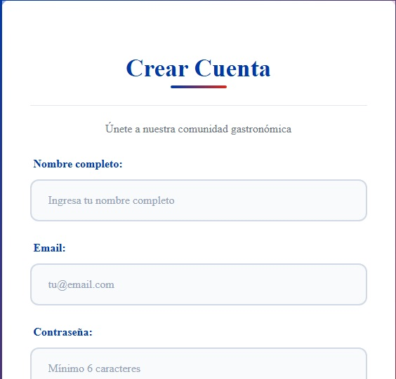
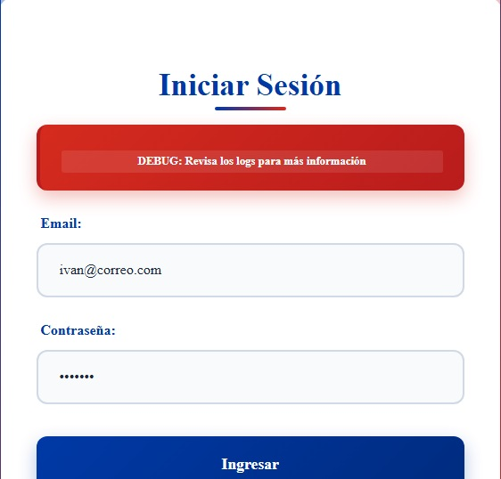
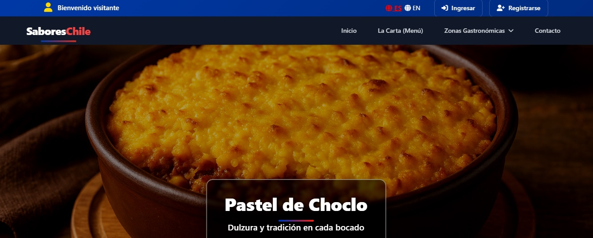
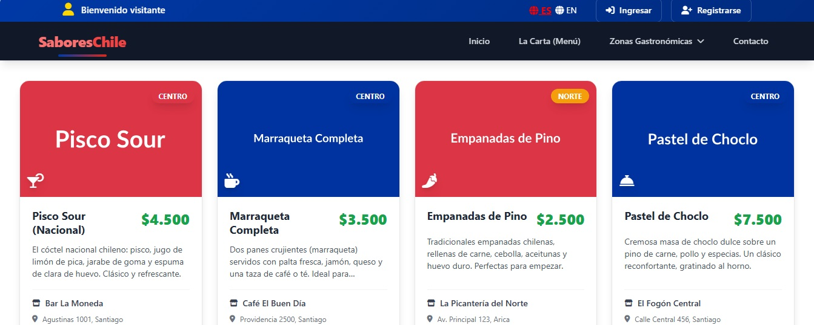
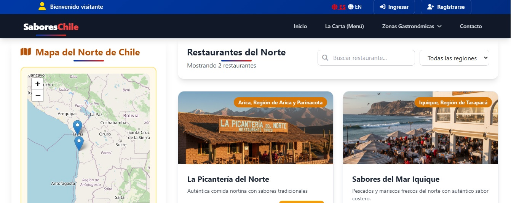
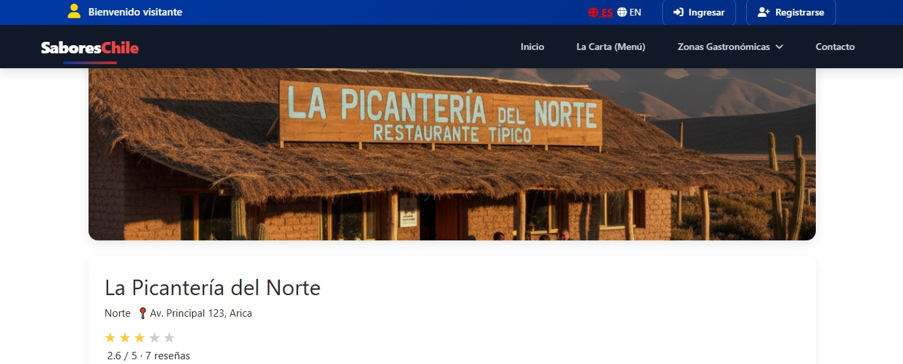
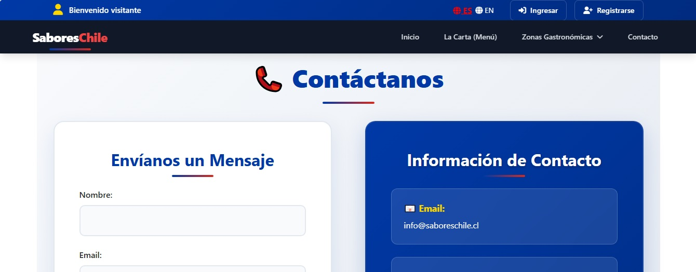
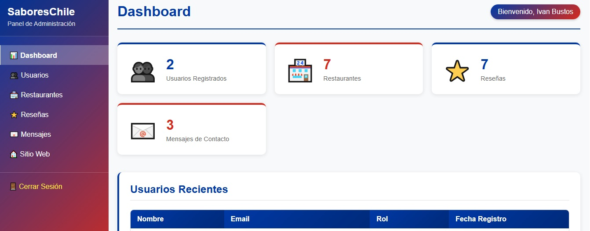

# Chilean Food App – SaboresChile

Aplicación web moderna para la gestión y visualización de comida tradicional chilena, desarrollada con **PHP, HTML, CSS, JavaScript y phpMyAdmin (MySQL)**, utilizando un **patrón MVC** y un sistema de **login / register con contraseñas encriptadas**.

---

## Descripción general

La aplicación permite a los usuarios:

- Explorar restaurantes de comida típica chilena.
- Ver detalles del restaurante (descripción, ubicación, imagen, calificación, etc.).
- Consultar menús y productos disponibles.
- Registrarse e iniciar sesión de forma segura.
- Dejar reseñas y valoraciones.
- Administrar contenido.

---

## Tecnologías utilizadas

- **Backend:** PHP (con patrón MVC)
- **Frontend:** HTML5, CSS3, JavaScript
- **Base de datos:** MySQL (gestionada con phpMyAdmin)
- **Arquitectura:** MVC (Model–View–Controller)
- **Seguridad:**
  - Encriptación de contraseñas (password_hash/password_verify o similar)
  - Validaciones en servidor
- **Otros:**
  - Sesiones en PHP para manejo de login
  - Librerias: Font Awesome / Leaflet

---

## Requisitos previos

Servidor web local:

- XAMPP

- PHP (versión recomendada: 7.4+ o 8.x)

- MySQL / MariaDB

- phpMyAdmin para gestionar la base de datos

- Navegador web moderno (Chrome, Firefox, Edge, etc.)

---

## Capturas de pantalla

- Formulario Registro de usuarios
  

- Página de Inicio de sesión
  

- Página de inicio
  

- Página de Menu(carta)
  

- Página de zona norte
  

- Página detalle restaurante
  

- Contacto
  

- Dashboard
  

---

## 👨‍💻 Autor

**Nombre:** Iván Bustos  
**Rol:** Desarrollador / Ingeniero Industrial
**GitHub:** [recker99](https://github.com/recker99)

---

## 📄 Licencia

Este proyecto corresponde al desarrollo realizado por **Iván Bustos**.

Las licencias y derechos de las tecnologías utilizadas (como **PHP**, **phpMyAdmin**, **MySQL**, librerías CSS/JS, etc.) pertenecen a sus respectivos autores y propietarios.

```text
© 2025 - Iván Bustos. El código propio del proyecto se distribuye bajo la licencia que se indique en este repositorio.
Las herramientas de terceros mantienen sus licencias originales.

```
